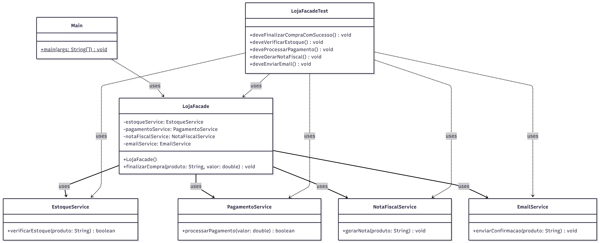

# 🛍️ Sistema de Compra Online com Façade

Projeto desenvolvido em Java com o objetivo de demonstrar a aplicação do **padrão de projeto Façade** em conjunto com o **princípio da responsabilidade única (SRP)**.

---

## 📌 Sobre o projeto

O sistema simula o processo de finalização de compras em uma loja online.

Para concluir uma compra, diferentes subsistemas precisam ser executados, como verificação de estoque, processamento de pagamento, geração de nota fiscal e envio de confirmação por e-mail.

O padrão Façade foi utilizado para simplificar essa comunicação, centralizando todo o fluxo em uma única classe.

---

## 🧱 Estrutura do projeto

```id="8h3jvk"
src/
├── main/
│   └── loja/
│       ├── EstoqueService.java      // Verificação de estoque
│       ├── PagamentoService.java    // Processamento de pagamento
│       ├── NotaFiscalService.java   // Geração de nota fiscal
│       ├── EmailService.java        // Envio de confirmação
│       ├── LojaFacade.java          // Fachada principal do sistema
│       └── Main.java                // Execução do sistema
│
└── test/
    └── loja/
        └── LojaFacadeTest.java      // Testes unitários
```

---

## 🧠 Padrões e princípios utilizados

### 🔹 Façade

Fornece uma interface simplificada para interação com múltiplos subsistemas.

No projeto:

* O cliente interage apenas com `LojaFacade`
* A fachada coordena todos os serviços internos
* O fluxo de compra fica centralizado e desacoplado

---

### 🔹 SRP (Single Responsibility Principle)

Cada classe possui uma única responsabilidade:

* `EstoqueService` → verificar estoque
* `PagamentoService` → processar pagamento
* `NotaFiscalService` → gerar nota fiscal
* `EmailService` → enviar confirmação
* `LojaFacade` → centralizar o fluxo do sistema
* `Main` → execução

---

## 📊 Diagrama de Classes



---

## ▶️ Como executar o projeto

### 🔹 Executar a aplicação (Main)

1. Abra o projeto no IntelliJ
2. Navegue até:

   ```
   src/main/loja/Main.java
   ```
3. Clique com o botão direito → **Run 'Main.main()'**

---

### 🧪 Executar os testes

1. Navegue até:

   ```
   src/test/loja/LojaFacadeTest.java
   ```
2. Clique com o botão direito → **Run 'Tests'**

> Certifique-se de que o JUnit 5 está configurado no projeto.

---

## ✅ Exemplo de saída

```id="tpob62"
Verificando estoque do produto: Notebook Gamer
Processando pagamento de R$4500.0
Gerando nota fiscal do produto: Notebook Gamer
Enviando e-mail de confirmação para compra de: Notebook Gamer
Compra finalizada com sucesso!
```
